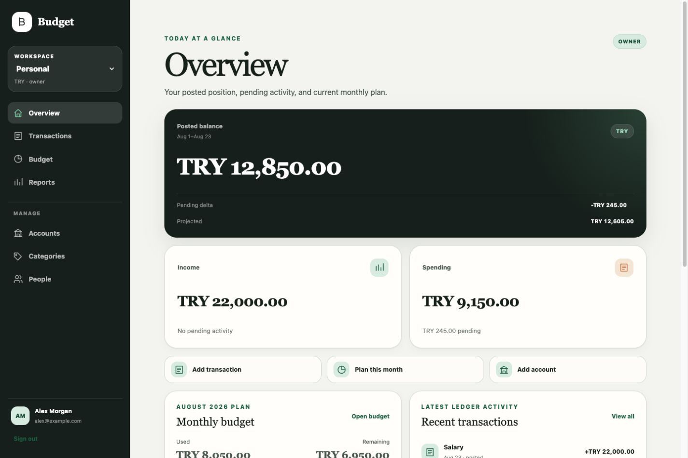

# Budget

Budget is an open-source, self-hostable personal finance workspace for understanding where
money is, where it went, and what remains in the monthly plan. It combines a responsive web
experience, a native SwiftUI iOS application, a Go modular-monolith backend, and PostgreSQL as
the only mandatory infrastructure dependency.



_Representative workspace data._

## What you can do

- See posted balances, pending activity, income, spending, and the current budget at a glance.
- Record expenses, income, refunds, split transactions, transfers, and adjustments without
  losing the ledger relationships behind each total.
- Organize money with multi-currency accounts and hierarchical income or expense categories.
- Plan monthly category budgets and compare them with posted allocation activity.
- Explore account and category reports for a selected period.
- Share a workspace through invitations and owner, editor, or viewer roles.
- Move between Overview, Transactions, Budget, Accounts, and More from compact web and iOS
  navigation; the wider web layout keeps reporting and management destinations visible.

Start with the [product tour](docs/product-tour.md), or review the accepted project direction:

- [Architecture](docs/architecture.md)
- [Technology stack](docs/tech-stack.md)
- [Domain model](docs/domain-model.md)
- [Architecture decisions](docs/decisions/README.md)
- [Configuration reference](docs/configuration.md)
- [Operations](docs/operations.md)

## Development

Canonical development occurs in a private repository. Stable, validated source snapshots
are published to the public `budget` repository.

The intended local workflow is:

```bash
cp .env.example .env
docker compose up -d postgres
make check
```

See [CONTRIBUTING.md](CONTRIBUTING.md) for contributor setup and validation commands.

## Self-hosting

Budget deliberately keeps self-hosting small: one application container and PostgreSQL. The
application image contains both the Go API and compiled React interface, served from the same
origin. No separate frontend service, Redis, message broker, or hosted cloud dependency is
required.

```bash
git clone https://github.com/nihatatay93/budget.git
cd budget
cp .env.example .env
docker compose up -d
```

Then open <http://localhost:8080> and register. The first account creates its own workspace.
The same responsive interface works in desktop and mobile browsers. The native iOS client can
connect to the same server using its public HTTPS address.

Before exposing it beyond your machine, set these in `.env`:

- `POSTGRES_PASSWORD` — the default is a placeholder.
- `BUDGET_PUBLIC_ORIGIN` — the exact origin browsers will use, including scheme and port.
  Writes are refused from any other origin, so a wrong value looks like sign-in working and
  every save failing.
- `BUDGET_SESSION_COOKIE_SECURE=true` once TLS terminates in front.
- `BUDGET_TRUSTED_PROXIES` if a reverse proxy sits in front, or all clients share one
  rate-limit bucket.

`BUDGET_HTTP_PORT` changes the published port when 8080 is taken.

For TLS, `docker compose --profile proxy up -d` adds Caddy on ports 80 and 443; set
`BUDGET_HOSTNAME` to your domain.

Two features are optional and off by default, and the application runs fully without either:
invitation email over SMTP, and display currency conversion. Enabling neither means no
outbound network connections at all.

- [Configuration reference](docs/configuration.md) — every setting
- [Operations](docs/operations.md) — health checks, backups, upgrades, failure modes

## License

Budget is available under the [MIT License](LICENSE).
