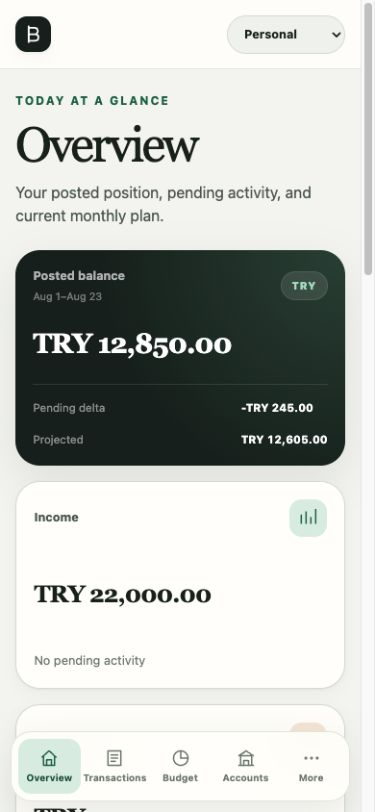

# Product Tour

Budget keeps the ledger model visible enough to be trustworthy while making common daily tasks
quick to reach. The web and iOS clients share the same destination names, financial language,
and permission behavior, with navigation adapted to each platform.

## Navigate the workspace

The primary destinations are:

- **Overview** — posted position, pending change, projected balance, current budget, recent
  transactions, account highlights, and top spending.
- **Transactions** — searchable activity plus entry points for expenses, income, refunds,
  splits, transfers, adjustments, pending items, editing, and soft deletion.
- **Budget** — a month-by-month category plan whose usage comes from posted allocations.
- **Accounts** — native and base-currency balances with account creation, editing, and archival.
- **More** — analysis, reports, categories, people, workspace switching, server details on
  iOS, and session controls.

On a wide browser window, a persistent workspace sidebar also exposes **Analysis**,
**Reports**, **Categories**, and **People** directly. On compact web layouts and iOS, the stable five-item
bottom navigation keeps the highest-frequency destinations within thumb reach and groups the
remaining workspace tools under More.

_Representative workspace data._

## Read the overview

The overview distinguishes three different views of money:

- **Posted** is authoritative activity and is the basis for balances, income, spending, and
  budget usage.
- **Pending** is structurally complete activity that has not posted yet.
- **Projected** combines posted position with the pending delta so future impact is visible
  without changing authoritative totals.

Transfers move money between accounts but do not become income or spending. Foreign-currency
entries retain their original account amount and their booked historical value in the
workspace base currency. Optional current exchange rates are display-only and never rewrite
the ledger.

## Record and organize activity

Every transaction is backed by entries, and categorized activity is backed by allocations.
The editor preserves the rules for balanced transfers, reconciled splits, refunds, opening
balances, and adjustments. Transaction deletion is recoverable soft deletion; the deleted
activity stops affecting balances, budgets, and reports.

Categories can form income or expense hierarchies. Their kind describes reporting purpose,
not amount sign, so a refund may correctly appear as a positive allocation to an expense
category. Protected Uncategorized categories keep otherwise unclassified activity reportable.

## Plan and report

Monthly plans set base-currency targets for expense categories. Usage includes only posted
allocations, while refunds reduce net usage. Reports let you select a date range and inspect
posted, pending, and projected account or category activity without maintaining a second set
of totals.

## Understand the pattern

Analysis answers a different question from Reports. Where Reports states one period's
position, Analysis describes settled behaviour over time, so every figure there is posted
activity only.

Pick a period — this month, a trailing few months, year to date — and the web client shows a
spending and income trend at a day, week, or month bucket, a ranked category breakdown with
each category's own trend, the weekday and daily rhythm of your spending, the payees you pay
most, and which accounts the money moved through. Each period is compared with the equal-length
period immediately before it, so "up 22%" always means the same thing, and a short list of
plain-language observations names what the numbers already show.

Transfers between your own accounts never count as spending anywhere in Analysis, and a refund
reduces a category's total rather than appearing as a charge.

iOS carries the same destination under More, drawn with Swift Charts rather than the web
client's inline SVG. Both read the same contract, so a period selected on either client
reports the same figures.

## Collaborate safely

Financial data belongs to a workspace. Owners manage membership and owner continuity, editors
manage financial records, and viewers receive a read-only experience. Invitation codes can be
shared directly or delivered through optional SMTP configuration. Every workspace-scoped API
request verifies membership on the server regardless of what a client displays.

## Use web and iOS together

The responsive web client and native SwiftUI app use the same OpenAPI contract and the same
server-side financial rules. Web authentication uses a protected same-origin cookie. The iOS
app stores a separate bearer credential in Keychain and can connect to any HTTPS Budget server
the user configures. A change recorded on either client is therefore immediately part of the
same workspace ledger.

## Self-hosting shape

The production image compiles the React client and embeds it into the Go server. That one
container serves both the interface and `/v1` API from the configured public origin, while
PostgreSQL remains the only stateful dependency. See [Configuration](configuration.md) for
settings and [Operations](operations.md) for TLS, health checks, backups, and upgrades.
